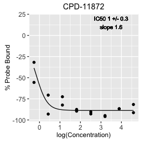
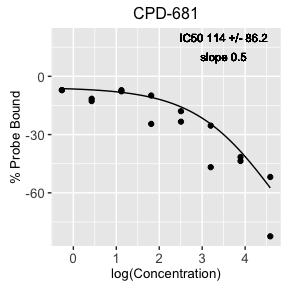
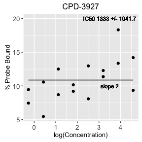

```r
library(BenCScore)
```

#A quick-start guide to BenCScore

This is a quick start guide to using the Bayesian EstimatioN and Compound Scoring (BenCScore) package for high-throughput screening data analysis. Practical use of the package is demonstrated by analyzing a fluorescence polarization screen for inhibitors of the p53-MDMX high-throughput screen conducted at the Broad Institute 2016. 

##Loading Data

```r
data(mdmx)
```

This package requires data with columns:

* Plate_ID: assay plate identifier  
* Row: row index of assay plate  
* Column: column index of assay plate   
* Compound_ID: unique compound identifier  
* Well_Type: experimental purpose of the well, must be one of "compound", "positive control", "neutral control"  
* Run_ID: if the high-throughput screen was conducted over multiple runs this identifies blocks  
* Compound_Plate: parent compound plate identifer  
* Concentration: compound concentration  
* Smiles: compound smiles  
* Run_Intent: purpose of the run  
* Value: measured value  

Checking the example mdmx data

```r
head(mdmx)
```

```
##    Compound_ID Row Column       Well_Type   Plate_ID Compound_Plate
## 1:               1      2 neutral control BR00077049               
## 2:               1      2 neutral control BR00077050               
## 3:               1      2 neutral control BR00077051               
## 4:               1      2 neutral control BR00077052               
## 5:               1      2 neutral control BR00077053               
## 6:               1      2 neutral control BR00077054               
##               Run_ID Concentration    Value Smiles Run_Intent
## 1: 7208-01-W01-02-01            NA 91.63956        VALIDATION
## 2: 7208-01-W01-02-01            NA 99.81507        VALIDATION
## 3: 7208-01-W01-02-01            NA 85.50146        VALIDATION
## 4: 7208-01-W01-02-01            NA 95.96784        VALIDATION
## 5: 7208-01-W01-02-01            NA 85.75996        VALIDATION
## 6: 7208-01-W01-02-01            NA 88.66022        VALIDATION
```

The screen can be checked for valid names with

```r
checkScreen(mdmx)
```

##Exploratory analysis

The entire screening campaing can be visualized by column-wise plots. The value of the y-axis in the plot is mili-fluorescence polarization. Across the screen there is good separation between the positive and neutral controls (except in the case of the confirmation-in-dose, 7208-01-W01-02-08). A positional effect is observable with mili-fluorescence polarization generally increasing with column number.


```r
columnPlot(mdmx)
```

 

The campaign can also be visualized by a scatter plot of replicates. In this plot the positional effect is much more obvious as spurious correlations between in the positive controls and the inactive compounds.


```r
primary <- mdmx[mdmx$Run_Intent == 'PRIMARYSCREEN', ]
scatterPlot(primary)
```

 

##Quality Control

In general normalization must be applied to plates to compare between them and across runs. On 384-well plates there are too few neutral control wells (typically 32) to accurately estimate the standard deviation. For this reason we prefer normalizing plates to percent effect of controls. This function overwrites the Value column stored in the screen.


```r
mdmx <- percentEffect(mdmx)
```

Plate patterns can be visualized using the wellHeatMap function and positional effects can be fixed using the fixPattern function.


```r
wellHeatMap(mdmx)
```

 


```r
#obviously the concentration-response experiments will have positional patterns
#7208-01-W01-02-08 should not be altered. 

primary <- mdmx[mdmx$Run_Intent !='CONFIRMATION_IN_DOSE', ]
confirmation <- mdmx[mdmx$Run_Intent == 'CONFIRMATION_IN_DOSE', ]
primary <- fixPattern(primary)
```

Again the replicate scatter plot can be visualized. Note the change in axes. In this plot the positive controls are gaussain scattered on both replicates as are the inactive compounds. 


```r
scatterPlot(primary)
```

 

#Apply models

The Bayesian model, robust z-score, and RVM t-test can be added to the screening data by simply calling the applyModels function. This step can be time consuming (~12 hours on a 2GHz i7 ).


```r
primary  <- addModels(primary, alternative='less', ROPE=-14.28, c=-14.28)
```

To decide what value to use for the ROPE and c we propose.

1. Select the maximum acceptable effective concentration to observe 50% effect (EC$_{50}$) at which a compound can be called active.  
2. Based on that EC$_{50}$, a theoretical 3 parameter logistic binding curve can be fit.  
3. The practical cutoff is then defined by the value of the theoretical binding curve at the primary screen's concentration.  

For example the p53-MDMX screen was run at 12.5 uM. We decided to call the maximum acceptable EC$_{50}$ 75 uM, based on the maximum concentration we were going to use in our secondary concentration-response screen. From those metrics the autoRope function preforms steps 1-3 to calculate a ROPE value for the Bayesian method.


```r
autoRope(assay.conc = 12.5, max.conc = 75)
```

```
## [1] 14.28571
```

Pay attention: the units of autoRope are percent effect and the sign is wrong! Currently the user must provide the correct ROPE to the addModels function.


```r
primary <- fread('~/Documents/Projects/Bayesian Score/7208/Compound Selection/primary.mdmx.analysis.csv')
```

#Selecting Compounds

Hits can be selected from any available model. To select hits from the Bayesian model rank order by the Alternate_Probability_t. These hits can be visualized by their primary screen replicate scatter again by calling the scatterPlot function. Notice how the compounds in the "wings" are not selected.


```r
compounds <- primary[primary$Well_Type == 'compound', ]
compounds <- compounds[order(compounds$Alternate_Probability_t, decreasing=TRUE), ]

#selecting the top 100 hits
hit_ids <- unique(compounds$Compound_ID)[1:100]

#plot selection
scatterPlot(compounds[compounds$Compound_ID %in% hit_ids, ])
```

 

The Bayesian method is able to provide an estimate of how many false negatives a selection leaves behind. The number of false negatives can be found by summing the alternate probability of the compounds not selected, as shown below.


```r
#deduplicate compounds
compounds <- compounds[!duplicated(compounds$Compound_ID), ]

#The estimated number of false negatives in the current hit selection
sum(compounds$Alternate_Probability_t[!(compounds$Compound_ID %in% hit_ids)], na.rm=TRUE)
```

```
## [1] 41.79415
```


#Curve Fitting

After hits have been selected and retested in concentration-response curves can be fit using the screenFit function.


```r
cpd <- confirmation[confirmation$Well_Type == 'compound', ]
cpd <- cpd[cpd$Compound_ID != '', ]

cpd <- cpd[order(cpd$IC50), ]
id <- unique(cpd$Compound_ID)
cpd <- split(cpd, cpd$Compound_ID)

curves <- lapply(id, function(x) plotCurves(cpd[[x]]))
```

                                                                                                                                                                                            
